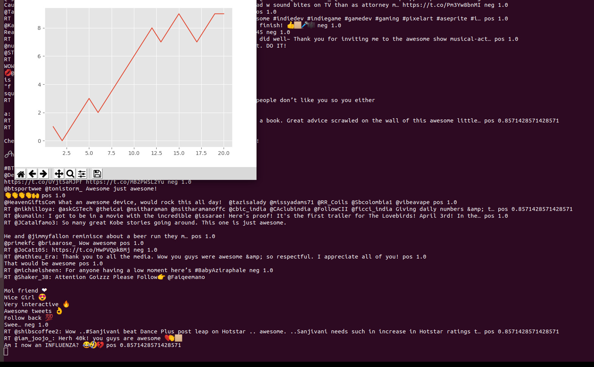

## LiveSentimentAnalyser
A live sentiment analyser about some keywords using live tweets from [twitter](https://twitter.com).

## Table of contents
* [Methodology](#Methodology)
* [Setup](#setup)
* [Using SentimentAnalyser](#Using SentimentAnalyser)
* [Sample output](#Sample output)
* [Tools Used](#Tools Used)
* [Source](#Source)
* [Future Work](#Future Work)

## Methodology
This  application can provide live and latest sentiment about particular topic by analysing the tweets received from twitter developer API through the sentiment analysis module. Prediction of each tweet is done using ensemble learning combining votes of various algorithms such SVM , NuSVM , Stochastic gradient descent , BayesClassifier and others. Algorithms were selected based on their performance on test set derived by partioning data in [short reviews](https://github.com/naman-32/LiveSentimentAnalyser/tree/master/short_reviews) directory , which contains pos and neg reviews file respectively. I got 75% average accuracy of ensemble classifier by extracting 5000 most relevant word features. Around 10,600 reviews are available and 600 reviews were used for testing after random shuffling.Then algos were trained , pickled and used. Only reviews with **more than 80% confidence** given by essemble classifier are used to plot live sentiment graph using matplotlib.         

## Setup
1. Ensure that pip is installed and upgrade it. Pip should already be available if you are using Python 3 >= 3.4 downloaded from python.org. For further installation instructions check [this](https://pip.pypa.io/en/stable/installing/).
2. If you plan on using a virtual environment, ensure virtualenv (Python 2) or venv (Python 3) is installed. Create a virtual environment and activate it. Detailed instructions [here](https://packaging.python.org/guides/installing-using-pip-and-virtual-environments/).
3. After cloning the repo, install the required packages using pip in the terminal:
```
python3 -m pip install -r requirements.txt
```
4. Create a [developer account at twitter](https://developer.twitter.com) and create an app.(requires approval by twitter for developer account for information security read [twitter developer agreement and policy details](https://developer.twitter.com/en/developer-terms/agreement-and-policy))
5. Then go to app section , create an app and generate the access token.
6. Copy consumer key, consumer secret key, access token , access secret token in [twitter_stream.py](https://github.com/naman-32/LiveSentimentAnalyser/blob/master/twitter_stream.py)
```
ckey=""
csecret=""
atoken=""
asecret=""
```

7. Run this command **once** , this will take time about an hour depending on the processor. 
```
python3 run_once_script.py
```
8. Done! Great for testing run test.py file and see the output.

## Using SentimentAnalyser
1. Clean the [output_from_twitter](https://github.com/naman-32/LiveSentimentAnalyser/blob/master/output_from_twitter) file each time sentiment analyser is run.
2. Change keyword in track argument by replacing desired keyword with "awesome" in last line of in [twitter_stream.py](https://github.com/naman-32/LiveSentimentAnalyser/blob/master/twitter_stream.py) shown below.
```
twitterStream.filter(track=["awesome"])
```
3. Open two terminals with virtual environment activated. Run these two commands in **separate terminals simultaneously** .
```
python3 twitter_stream.py
python3 plotting_live_data.py
```

## Sample output
Here is a sample output that I got using keyword "awesome"



## Tools Used
- NLTK
- Twitter Developer API
- Pickle
- Scikit Learn
- Matplotlib

## Source
- [dataset from https://pythonprogramming.net/](https://pythonprogramming.net/static/downloads/short_reviews/)
- [twitter developer API Docs](https://developer.twitter.com/en/docs)
- nltk tutorial by [sentdex](https://www.youtube.com/watch?v=FLZvOKSCkxY&list=PLQVvvaa0QuDf2JswnfiGkliBInZnIC4HL)

## Future Work
- Words features count could be optimized
- Confidence allowed can be optimized
- We seems to get tweets with neg bias hence opposite optimum bias like 1.3 can provided to pos while plotting.
- HyperParameters of SVM classifier tuned.

